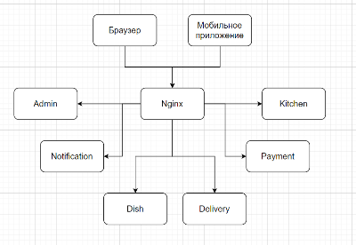

<h1>Проект доставка еды "Быстро и в точку"</h1>

<h3>Описание</h3>
- имеет каталог блюд  
- может принимать заказы клиента на сайте. Либо через скачанное клиентами приложение  
- предоставляет клиенту курьерскую доставку. Клиент может контролировать положение курьера  
- предоставляет курьерам приложения, где они могут отчитываться о заказах, обновлять свое положение  
- имеет админку в виде веб приложения, где можно оформлять поставки продуктов, а также видеть прибыль.  

<h3>Опишем структуру проекта job4j_fast_foot.</h3>
/admin/ - админка  
/dish/ - сервис блюд  
/order/ - сервис заказов  
/delivery/ - сервис доставки  
/kitchen/ - сервис кухни  
/payment/ - сервис платежей  
/notification/ - сервис уведомлений  
/domains/ - доменные модели  

<h3>Архитектура.</h3>

  

Nginx - сервис HTTP для маршрутизации запросов к сервисам.  

